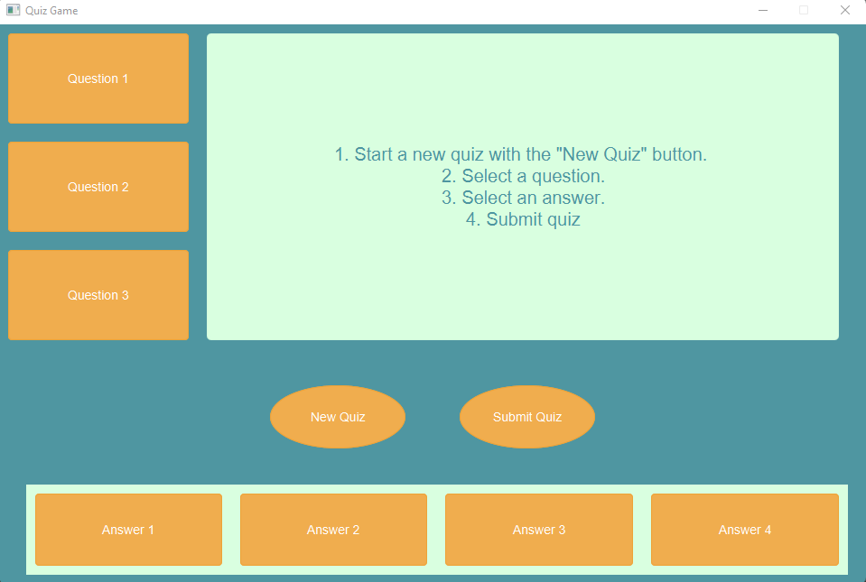
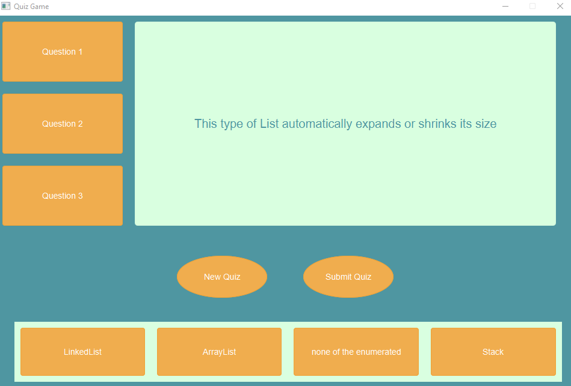
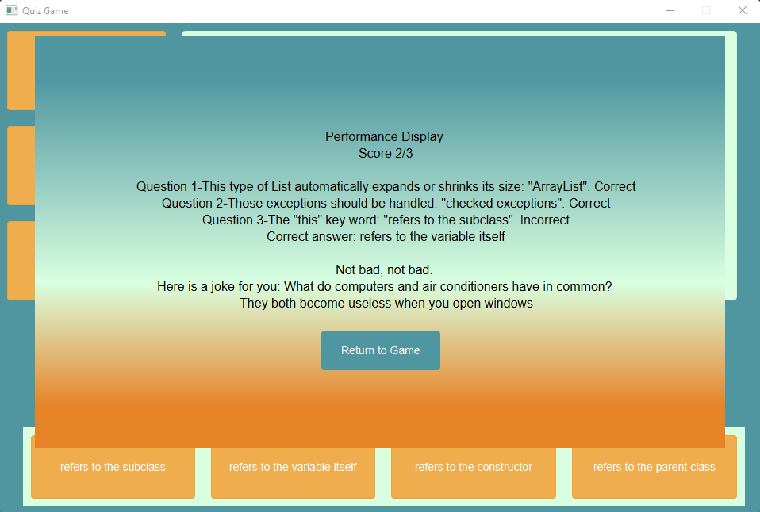

# Get-A-Hundred Java Quiz for Geniuses Only

## Project Overview
Done throughout my second year of College in Computer Science for my Java class, the Get-A-Hundred Java Quiz for Geniuses Only project focuses on developing a desktop application that allows a user to test their knowledge of Java concepts. The project is developed using JavaFX.

## Table of Contents
- [Project Description](#project-description)
- [Technologies used](#technologies)
- [Design](#design)
- [Challenges](#challenges)
- [Future Improvements Ideas](#improvements)
- [Acknowledgments](#acknowledgments)
- [Notes](#notes)

## Project Description
### Application's purpose
The Get-A-Hundred Java Quiz provides an easy and fun way to study basic Java concepts. When the application starts, instructions are displayed in the question box to make the application user-friendly. The application possesses 30 Java questions from which three are randomly selected every time a new quiz is started. There are four possible answers per question, but only one right answer. A "New Quiz" button allows you to start a new quiz with different questions. A "Submit Quiz" button provides a summary display of the user's performance. The summary display contains a score out of 3 (because there are three questions). It also has a funny message and a Java joke that are different depending on the score obtained. 

## Technologies Used When Building The Application
This desktop application is built using _Java_, _JavaFX_, and _BootstrapFX_ to create an appealing user interface.

## Design
### Classes Structure of the Application
The application has multiple classes and interfaces. There is an abstract class called _Question_. It contains the basic information of a question which is the question itself and the answer. The Question class implements an interface called _IValidatable_ which has a method that validates if the given answer is correct or not. The _MultipleChoiceQuestion_ class extends the _Question_ class since a multiple-choice question is a question. Besides a question and an answer, a multiple-choice question also contains an ArrayList of possible answers and a selected answer for each question. There is a _Quiz_ class that contains an ArrayList of multiple-choice questions. The class implements the _IQuizzable_ interface which contains a method to initialize the quiz, submit it, and display the summary. The initialize method reads from a file and stores the different parts of a file's line in variables or ArrayList, as mentioned above. This makes the quiz application flexible to other types of quizzes since the file's content could be easily changed to other questions. The _RandomQuiz_ class extends the _Quiz_ class since a random quiz is a quiz. However, the _RandomQuiz_ class implements the _IShufflable_ interface which mixes the questions in the ArrayList they are stored in. The _QuizUI_ class contains the user interface with labels and buttons. It is the part of the application with which the user interacts. 

### UML Diagram

### Screenshots of the Application

## Challenges
1. Creating the user interface (UI) in the desired way was challenging. I needed to imagine the layout of the UI components such as the buttons and the label for the question. I needed to put them in multiple horizontal and vertical boxes to create the planned look. I also needed to choose the proper color scheme that will be pleasant to the human eye.
2. Reading from the file with the 30 questions was also challenging. Since one line contained a question, the four possible answers, and the correct answer, I had to separate the components on each line of the file with ';' and store the different elements in variables or ArrayList (for the possible answers, for example).
3. The JUnit Tests were interesting to do. Since I am not used to writing them, I needed extra time to verify that every method is tested properly.

## Future Improvements Ideas
1. The application and its components such as buttons and the label for the question are not resizable. If the question or the answers are longer than the width of their containers (buttons or labels), the content of the String is not entirely displayed (suspension points on the UI show that the String is too long). I believe that implementing a feature that allows the user to hover over the String (in the button or the label) to see its entire content would be useful or to make the UI more responsive.
2. I would like to create a Quiz instead of a random quiz by implementing the _IQuizzable_ interface differently. For example, I would want the questions to be sequentially displayed (not randomly) when a new quiz starts. For example, the first time a quiz is initialized, it would display the questions from one to three. When a new quiz is started with the "New Quiz" button, I would want questions four to six to be displayed.
3. When an answer is selected, I would like to highlight the answer by changing its background color. When I come back to the question, the answer should still be highlighted. Currently, the selected answer is only highlighted when clicked, but when I go to another question and then come back to the same one, it is not highlighted anymore even though the answer has been selected. 

## Acknowledgments
I would like to thank my teacher, Tawfiq Jawhar, for guiding me throughout the project.
I would like to thank my brother, Petar Kehayov, for helping me with the task of reading from a file and displaying the questions.

## Notes
For the sake of this project, the _IQuizzable_ interface was only implemented in the _RandomQuiz_ class since the quiz's purpose is to generate random questions. The _Quiz_ and the _Question_ classes can be extended by other subclasses defining other specific quizzes and questions. This allows the application to be extended on multiple levels. 
\*The 30 questions are inspired by the book called _Starting Out with Java: Early Objects (6th Edition)_ by Tony Gaddis.
For the "How many constructors can a class have?" question, the right answer comes from https://stackoverflow.com/questions/53625567/in-java-how-many-constructor-can-we-create-in-one-class#:~:text=You%20can%20have%2065535%20constructors,(According%20to%20Oracle%20docs).
